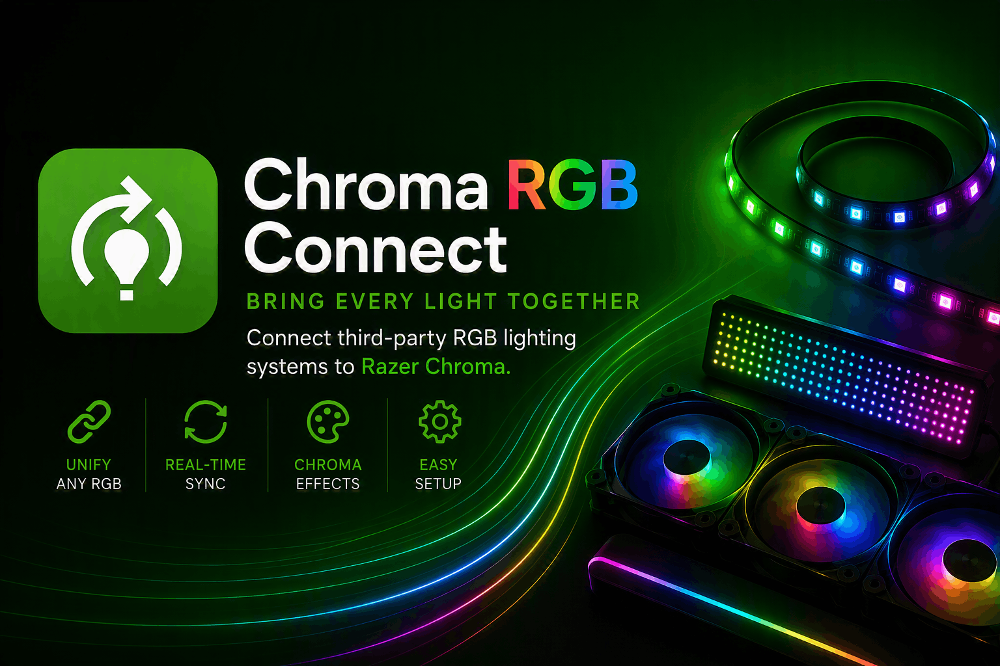

<p align="center">
	
</p>

<p align="center">
	<a href="https://github.com/TheDouglife/chroma-rgb-connect/releases"></a>
	<a href="https://github.com/TheDouglife/chroma-rgb-connect/actions/workflows/ci.yml"></a>
	<a href="https://github.com/TheDouglife/chroma-rgb-connect/blob/main/LICENSE"></a>
	<a href="https://github.com/TheDouglife/chroma-rgb-connect/issues"></a>
</p>

# Chroma RGB Connect

Connect supported third-party RGB lighting hardware to Razer Synapse through OpenRGB, then manage it from one Windows desktop app.

> **Current release:** `1.0.3` for Windows x64

## What it does

- Bridges supported third-party lighting devices into Razer Synapse.
- Uses OpenRGB to detect and communicate with compatible hardware.
- Runs a local lighting service alongside the desktop control app.
- Includes an installer that starts the service and app after setup.
- Checks for the Microsoft Visual C++ runtime and WebView2 during installation.

Hardware support depends on the devices and providers supported by the bundled OpenRGB integration. See the [issues](https://github.com/TheDouglife/chroma-rgb-connect/issues) for compatibility questions and reports.

## Install

### Recommended: Windows installer

1. Download the latest [`ChromaConnectSetup` installer](https://thedouglife.github.io/chroma-rgb-connect/installer/) or choose an installer from the [GitHub Releases](https://github.com/TheDouglife/chroma-rgb-connect/releases) page.
2. Run the installer as an administrator.
3. Complete the prerequisite checks if the Microsoft Visual C++ runtime or Microsoft Edge WebView2 Runtime is missing.
4. Launch **Chroma RGB Connect** and follow the in-app setup flow.

The installer targets 64-bit Windows and is intended for Windows 10 or later. Close other RGB control utilities if they conflict with the devices you want Chroma RGB Connect to manage.

## Development

### Prerequisites

- Windows 10 or later, x64
- [.NET 8 SDK](https://dotnet.microsoft.com/download/dotnet/8.0)
- Visual Studio 2022 or another editor with .NET development support
- The SDK and Native projects included under `src/SDK` and `src/Native`

Restore dependencies, build the solution, and run the test suite from the repository root:

```powershell
dotnet restore ChromaConnect.sln
dotnet build ChromaConnect.sln -c Release
dotnet test ChromaConnect.sln -c Release --no-build
```

To build the Windows app for its release runtime:

```powershell
dotnet build src/App/ChromaConnect.App.csproj -c Release -r win-x64
```

The repository is organized into the desktop app, local service, shared code, installer, and test projects under `src/` and `tests/`.

## Contributing

Bug reports, compatibility notes, documentation improvements, and code contributions are welcome. Before opening an issue, check existing issues and include your Windows version, app version, affected hardware, related RGB software, and clear reproduction steps.

Pull requests should include focused tests or an explanation of why tests are not applicable.

## Support and security

- Use [GitHub Issues](https://github.com/TheDouglife/chroma-rgb-connect/issues) for bugs, questions, and feature requests.
- Review [release notes](release-notes.md) and [all releases](https://github.com/TheDouglife/chroma-rgb-connect/releases) when troubleshooting a version-specific issue.
- Do not disclose security-sensitive information in a public issue. Contact the maintainer privately through the repository owner’s GitHub profile.

## License

Chroma RGB Connect is licensed under the [MIT License](LICENSE).
